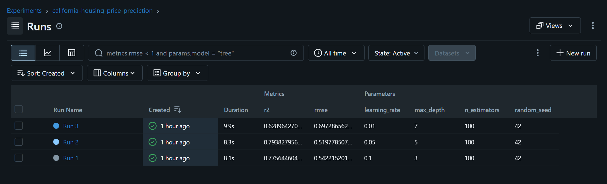

# House Price Prediction — Experiment Tracking with MLflow

## 1. Task description

Train the **same regression model three times** with different hyperparameters on the
California Housing dataset, track every run with MLflow, and pick the best one.

- **Data:** California Housing (20,640 rows, 8 features, target = median house value in $100,000).
- **Split:** 80% training / 20% validation, fixed seed (`random_state=42`).
- **Model:** `GradientBoostingRegressor` (100 trees in every run).
- **Runs:**

  | Run | Max Depth | Learning Rate |
  |-----|-----------|---------------|
  | Run 1 | 3 | 0.1 |
  | Run 2 | 5 | 0.05 |
  | Run 3 | 7 | 0.01 |

- **Tracked in MLflow for every run:** parameters (`max_depth`, `learning_rate`), validation
  metrics (RMSE, MAE, R²) and the trained model as an artifact.
- **Model selection:** lowest validation **RMSE**.

## 2. How to run

Requires Python 3.10+ and an internet connection on the first run (scikit-learn downloads
the dataset once).

```bash
# 1. create and activate a virtual environment
python -m venv .venv
.venv\Scripts\Activate.ps1          # Windows PowerShell
# source .venv/bin/activate         # macOS / Linux

# 2. install the dependencies
pip install -r requirements.txt

# 3. train the three experiments
python train.py

# 4. open the MLflow UI (run it in the same folder as train.py)
mlflow ui --backend-store-uri sqlite:///mlflow.db
```

Then open <http://127.0.0.1:5001>, choose the experiment
`california-housing-price-prediction`, tick the three runs and click **Compare**.
The UI can take a few seconds to start.

Tested with Python 3.12, `mlflow` 3.17.0 and `scikit-learn` 1.9.1.

## 3. MLflow experiment results




## 4. Comparison table


| Run | Max Depth | Learning Rate | RMSE | MAE | R² |
|-----|-----------|---------------|------|-----|----|
| Run 1 | 3 | 0.1 | 0.5425 | 0.3719 | 0.7754 |
| **Run 2** | **5** | **0.05** | **0.5199** | **0.3534** | **0.7937** |
| Run 3 | 7 | 0.01 | 0.6972 | 0.5311 | 0.6290 |

## 5. Selected best model

**Run 2** — `max_depth = 5`, `learning_rate = 0.05` (lowest validation RMSE).

## 6. Why this model

- RMSE is the primary metric, and Run 2 has the lowest: 0.5199, against 0.5425 for Run 1
  and 0.6972 for Run 3. MAE and R² rank the three runs in the same order, so the choice
  does not depend on which metric is looked at.
- Run 2 is not overfitting: its training RMSE (0.4666) is only slightly below its
  validation RMSE (0.5199).
- Run 1 is a little too simple (depth 3), so it misses some structure in the data.
- Run 3 is clearly the worst because it **underfits**: with a learning rate of 0.01 and only
  100 trees, the model barely learns (its training RMSE is already 0.663). This says more
  about the fixed number of trees than about depth 7 itself — the same configuration with
  1,000 trees reaches a validation RMSE of 0.4648 in a side check — but with the three
  configurations and 100 trees specified for this task, Run 2 is the best choice.
